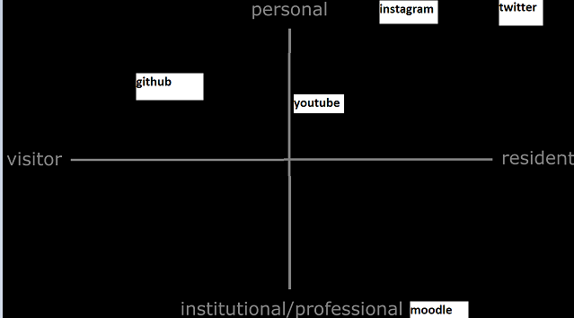
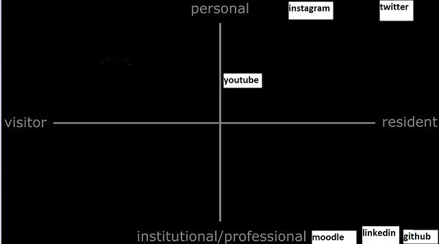

## Reflection on digital identities

This writing briefly reflects on my understanding of digital identities and how I use my digital identity in the past future and present along with general ideas about digital identities
 
What is a digital identity?
 
 
A digital identity is how you engage with the internet and how each interaction correlates to different modes on the VR map made by David White et al, essentially how your attitude is to the internet whether it be a professional response or private and used more for fun, there is also the scale of how permeant / findable your activity is on the internet is based on if your activity falls in the visitor or resident where resident is like making a comment or a post and visitor is just browsing
 
Previous ideas on digital identity  
 
One previous idea on digital identity was the idea of native and immigrants this meant that some people were raised on the internet and are well versed in how to operate on it and do so frequently for many tasks both professional and personal whilst immigrants were people who were not and had to learn all at once rather than as they aged, this ties into the stereotypes surrounding different generations so generation Z would be more of a native whilst the boomer generation would be more of immigrant as gen Z would have grown up with the more current technology along with being more likely to have a better view of the internet as many boomers don’t like using it, however this model has been updated to the more accurate VR map made by David White
## Current ideas on digital identity  
More specific to me  
 
##My past digital identity	 
 
In the past my digital identity was very limited, whilst I did interact from a very early age, since I was on the internet from the age of 3, I didn’t have any residency till secondary school with the VLE which would be a very mild form of professional / resident  at the same time I it wasn’t until 14 that I would gain twitter as a form residence and on the personal side of the VR map especially since its more public then finally gaining a lot more residency with more social media and other accounts such as Instagram Reddit and tiktok  

 
My current digital identity  
  
my current digital identity has things on both sides of the scale in terms of resident to visitor since with a large usage of social media but due to the lack that interact with the outer world with my social media it does not lend itself to being the complete left side on any of my social media apart from twitter which i am more active on but purely in a individual way since it is not in any way used professionally
 
my current only professional entry on the VR map is the use of Moodle or any account that is related to Essex university and so therefore is quite baron in comparison to other areas  
 
My future plans for my digital identity  
 
I plan to add more entries to the professional side on the VR map, to do this I could take up blogging to note things that I think are important and as a creative outlet that I could to show skills and possibly get a job if not that then it could be considered more individual since I would be doing it for fun but regardless in professional manner and would not be connecting too much of a personal life too it  

Another possible way to improve my digital identity is to make a linked in account and be able to interact with other people in my field this would add to both my resident and professional modes of the VR map and would be a good gateway into the professional world

 
currently I think I’m doing well in the aspect of being a resident as I have many resident areas on the internet with social media being a large one that I keep separate to my professional life and with that in mind I am doing well on a personal level in relation to digital identity as I have made sure to keep professional and private completely different so to not cause problems in either one
 
References:
White, David. 2021. "Visitors & Residents". David White. http://daveowhite.com/vandr/.

