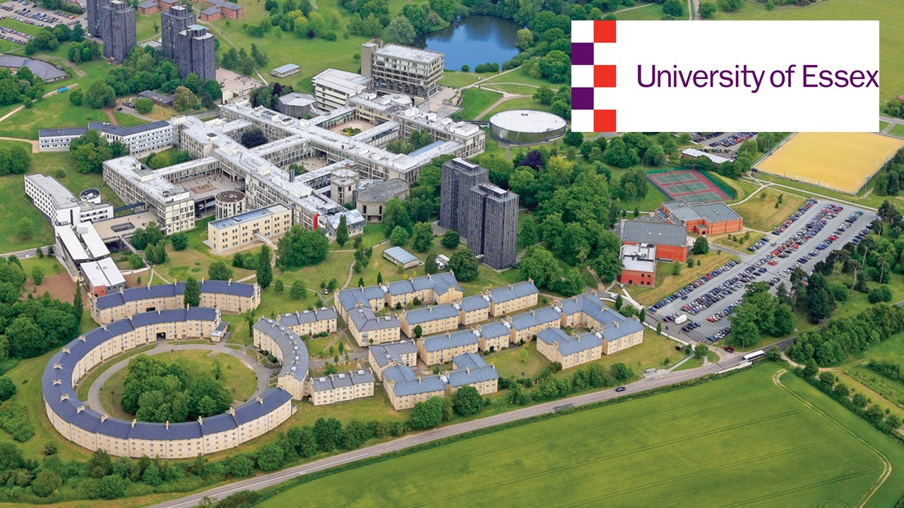

## Charles Rumm
##Introduction 
I’m Charles Rumm, a University student currently studying psychology at the University of Essex; I’m 18 and have been interested in psychology for a while now ever since I read a booklet on psychology and wanted to know more, I have more of a particular interest in reasons in a few specific areas of psychology such as why we have certain fears and where they come from, along with other intricacies of how the mind works, I also have a personal interest in how society also affects psychology as well however that is more of a personal interest and less related to my studies since I don’t study sociology currently.

**Studying psychology at university**  
I’m currently studying psychology at the university of Essex, this will be for three years and im currently in my first year, i hope to leave univerisity with alot of understanding in psycholgy along with other life skills and expiranceses that will aid in my professional life 

 

## Previous academic work
In terms of qualifications and academic work I have graduated from secondary school and college with both GCSEs and A-levels along with other experiences , the subjects chosen by me at those stages help with my interest in how humans work as college I chose psychology (which helps me currently in my current course) alongside sociology and applied human biology all geared to giving me a better understanding of how humans work which as mentioned before I carried on in Uni with my study in psychology which I hope to study later or use in some part of the service industry, in GCSE whilst my study was at a lower level I did subjects such as geography, biology, chemistry, maths, English language and literature, religious studies, ICT and computer science   
 
Due to my subject computer science and ICT I have experience in coding (low level (python)) and media production involving sound recording and editing using audacity, animation and asset making using flash and Photoshop and web development using Dreamweaver with these skills it means I can not only use those programs but can also learn other similar programs by relating it to them

 

## Contact
As of this point my contact is:
cr21495[at]essex[dot]ac[dot]uk
 

## Academic pages/associations/clubs

in secondary school i was active in the faith part of my school which involved a good amount of responsibilities, some of those included helping in mass with alter serving and representing the school in terms of faith, this meant that i had to be committed and stick to a schedule and was relied upon to turn up during lunch times to help showing dedication  
i was also active in the chess club, which whilst less demanding it still was a commitment and shows problem solving skills

 

## Other relevant experience 

I took part in NCS meaning that I learnt that I had to display and learn skills such as problem solving, team work and public interaction as for the third week of NCS there was a charity week where we had to go out and raise money for a specific charity, this was defiantly the more tasking side of the NCS with this part needing to plan a way to raise money (we decided a sponsored walk) but also to work together to create things to raise awareness, all this was done as mentioned in one week so the time constraint meant it to be one quickly and effectively,  There was also the issue of not have a charity permit so we couldn’t accept in person money and had to try and direct people to pay online rather than giving away their change  
 
In school I was also a prefect, which involved having specific duties carried out at a certain time each day which meant I had to be on time and do my job, which meant I had to practice time management and committing to a specific task at hand which most of the time would be standing at points at the school calling out improper behaviour,  not only that but I was also tasked with faith related tasks such as helping out with the mass at our school since it was a religious school, this has made me used to having to be depended on and part of a team.
 
## Future
I my future I plan to start blogging for both personal and professional reasons, when this happens I’ll add links to this on this page
 

